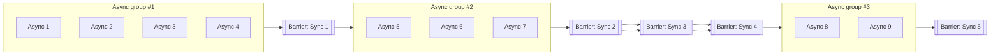
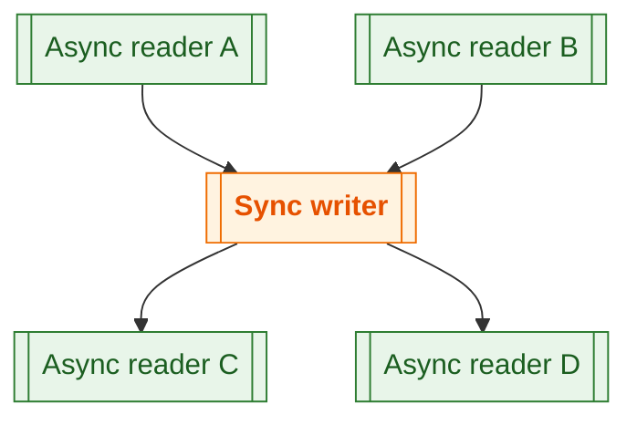
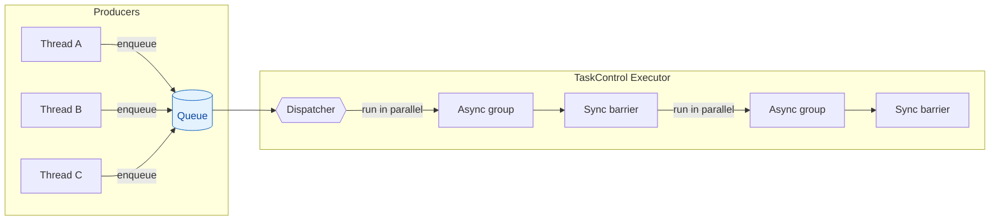

# TaskControl

[NuGet: iszbela.TaskControl](https://www.nuget.org/packages/iszbela.TaskControl)

It handles the chained control flow of synchronous/asynchronous tasks.

- **What it solves:** Run non‑thread‑safe operations from multiple threads by enqueueing them; async items may run concurrently inside a group, while sync items act as barriers between groups.
- **Key ops:** `AddAsync(...)`, `AddSync(...)`, and an awaitable `AddAsyncTask(...)` variant.

---

## Install

```bash
# .NET CLI
 dotnet add package iszbela.TaskControl
```

```powershell
# Package Manager
 Install-Package iszbela.TaskControl
```

---

## Quick start

```csharp
using iszbela.TaskControl;
using System;
using System.Threading;

public class Example
{
    private static readonly TaskControl taskcontrol = new TaskControl();

    public void Test()
    {
        using var cts = new CancellationTokenSource();

        // Async group #1 (can run in parallel)
        taskcontrol.AddAsync(() => Console.WriteLine("Async 1"), cts.Token);
        taskcontrol.AddAsync(() => Console.WriteLine("Async 2"), cts.Token);
        taskcontrol.AddAsync(() => Console.WriteLine("Async 3"), cts.Token);
        taskcontrol.AddAsync(() => Console.WriteLine("Async 4"), cts.Token);

        // Barrier #1
        taskcontrol.AddSync(() => Console.WriteLine("Sync 1"), cts.Token);

        // Async group #2
        taskcontrol.AddAsync(() => Console.WriteLine("Async 5"), cts.Token);
        taskcontrol.AddAsync(() => Console.WriteLine("Async 6"), cts.Token);
        taskcontrol.AddAsync(() => Console.WriteLine("Async 7"), cts.Token);

        // Barrier #2..#4
        taskcontrol.AddSync(() => Console.WriteLine("Sync 2"), cts.Token);
        taskcontrol.AddSync(() => Console.WriteLine("Sync 3"), cts.Token);
        taskcontrol.AddSync(() => Console.WriteLine("Sync 4"), cts.Token);

        // Async group #3
        taskcontrol.AddAsync(() => Console.WriteLine("Async 8"), cts.Token);
        taskcontrol.AddAsync(() => Console.WriteLine("Async 9"), cts.Token);

        // Final barrier
        taskcontrol.AddSync(() => Console.WriteLine("Sync 5"), cts.Token);
    }
}
```

### Execution plan (flow diagram)



> **Why this is clearer than a static image:** groups and barriers are labeled; it is obvious where concurrency happens (inside groups) and where strict ordering applies (barriers).

---

## Shared state example (safe sequencing)

This replaces the previous screenshot with a minimal, copy‑pastable sample.

```csharp
using iszbela.TaskControl;
using System;
using System.Collections.Generic;
using System.Threading;

public class Example
{
    private static readonly List<int> ints = new();
    private static readonly TaskControl taskcontrol = new();

    public void Test()
    {
        using var cts = new CancellationTokenSource();

        // Async readers (can overlap)
        taskcontrol.AddAsync(() =>
        {
            foreach (var ii in ints)
            {
                // read-only work...
            }
        }, cts.Token);

        taskcontrol.AddAsync(() =>
        {
            foreach (var ii in ints)
            {
                // read-only work...
            }
        }, cts.Token);

        // A sync writer acts as a barrier => no overlap with readers/writers
        taskcontrol.AddSync(() =>
        {
            if (ints.Count > 2) ints.RemoveAt(2);
        }, cts.Token);

        // Readers after the writer (may overlap with each other again)
        taskcontrol.AddAsync(() =>
        {
            foreach (var ii in ints)
            {
                // read-only work...
            }
        }, cts.Token);
    }
}
```

### Concurrency pattern for shared state



*(The custom colors above render on GitHub too; remove `classDef` blocks if you prefer default theming.)*

---

## Multi‑producer enqueue (threads adding work)

```csharp
using iszbela.TaskControl;
using System;
using System.Collections.Generic;
using System.Linq;
using System.Threading;
using System.Threading.Tasks;

public class Example
{
    private readonly List<int> ints = new() { 0,1,2,3,34,34,55,2,2 };
    private static readonly TaskControl taskcontrol = new();

    public async Task Test()
    {
        using var cts = new CancellationTokenSource();

        // Multiple threads enqueue tasks concurrently
        Task.Run(() => taskcontrol.AddAsync(() =>
        {
            foreach (var item in ints) Console.WriteLine(item);
        }, cts.Token));

        Task.Run(() => taskcontrol.AddAsync(() =>
        {
            foreach (var item in ints) Console.WriteLine(item);
        }, cts.Token));

        Task.Run(() => taskcontrol.AddSync(() =>
        {
            if (ints.Count > 0) ints.RemoveAt(0);
        }, cts.Token));

        // Awaitable async task variant that returns a result (as in the screenshot)
        List<int> ii = null!;
        await taskcontrol.AddAsyncTask(() =>
        {
            ii = ints.Where(x => x == 2).ToList();
        }, cts.Token);

        Console.WriteLine($"ii list count: {ii.Count}");
    }
}
```

### Queueing model (conceptual)



---

## Notes

- **Cancellation:** All calls pass an optional `CancellationToken`. Cancelled items won’t start; in‑flight operations should cooperatively honor the token.
- **Thread‑safety:** Treat `AddSync` as the serialization point for non‑thread‑safe work. As long as mutating operations are placed behind a sync barrier, readers before/after won’t overlap with writers.
- **Copy‑pasting:** All samples above compile as‑is, so readers don’t need screenshots.

---

## License

MIT
