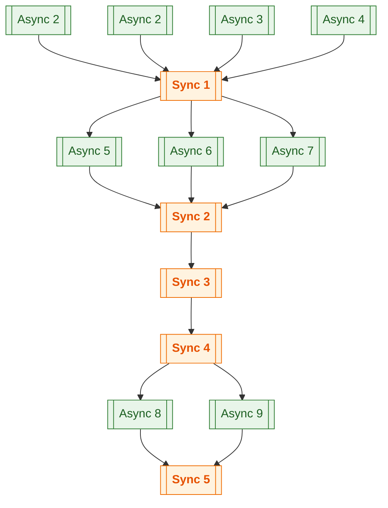

# TaskControl

[NuGet: iszbela.TaskControl](https://www.nuget.org/packages/iszbela.TaskControl)

It handles the chained control flow of synchronous/asynchronous tasks.

Description:

The package implements a mechanism for chaining async and sync tasks to execute sequentially.

Async tasks are executed concurrently. Whereas async- sync, and sync tasks are alternated, ensuring that each task waits for the completion of the previous task(s) before starting.

## Install

```bash
# .NET CLI
 dotnet add package iszbela.TaskControl
```

```powershell
# Package Manager
 Install-Package iszbela.TaskControl
```

---


Example of the process:
---


## Quick start

```csharp
using iszbela.TaskControl;
using System;
using System.Threading;

public class Example
{
    private static readonly TaskControl taskcontrol = new TaskControl();

    public void Test()
    {
        using var cts = new CancellationTokenSource();

        
        taskcontrol.AddAsync(() => Console.WriteLine("Async 1"), cts.Token);
        taskcontrol.AddAsync(() => Console.WriteLine("Async 2"), cts.Token);
        taskcontrol.AddAsync(() => Console.WriteLine("Async 3"), cts.Token);
        taskcontrol.AddAsync(() => Console.WriteLine("Async 4"), cts.Token);

        taskcontrol.AddSync(() => Console.WriteLine("Sync 1"), cts.Token);

        taskcontrol.AddAsync(() => Console.WriteLine("Async 5"), cts.Token);
        taskcontrol.AddAsync(() => Console.WriteLine("Async 6"), cts.Token);
        taskcontrol.AddAsync(() => Console.WriteLine("Async 7"), cts.Token);

        taskcontrol.AddSync(() => Console.WriteLine("Sync 2"), cts.Token);
        taskcontrol.AddSync(() => Console.WriteLine("Sync 3"), cts.Token);
        taskcontrol.AddSync(() => Console.WriteLine("Sync 4"), cts.Token);

        taskcontrol.AddAsync(() => Console.WriteLine("Async 8"), cts.Token);
        taskcontrol.AddAsync(() => Console.WriteLine("Async 9"), cts.Token);

        taskcontrol.AddSync(() => Console.WriteLine("Sync 5"), cts.Token);
    }
}
```




This makes it easy to make non-thread-safe processes thread-safe. Use it for any procedure that is not thread-safe but needs to be accessed from multiple threads simultaneously. The only thing you need to consider is which operations can run concurrently and which ones must execute sequentially (i.e., synchronously). You don't need to handle the implementation of the control mechanism.

```csharp
using iszbela.TaskControl;
using System;
using System.Collections.Generic;
using System.Threading;

public class Example
{
    private static readonly List<int> ints = new();
    private static readonly TaskControl taskcontrol = new();

    public void Test()
    {
        using var cts = new CancellationTokenSource();

        // Async readers (can overlap)
        taskcontrol.AddAsync(() =>
        {
            foreach (var ii in ints)
            {
                // read-only work...
            }
        }, cts.Token);

        taskcontrol.AddAsync(() =>
        {
            foreach (var ii in ints)
            {
                // read-only work...
            }
        }, cts.Token);

        // A sync writer acts as a barrier => no overlap with readers/writers
        taskcontrol.AddSync(() =>
        {
            if (ints.Count > 2) ints.RemoveAt(2);
        }, cts.Token);

        // Readers after the writer (may overlap with each other again)
        taskcontrol.AddAsync(() =>
        {
            foreach (var ii in ints)
            {
                // read-only work...
            }
        }, cts.Token);
    }
}
```

---

## Multi‑producer enqueue (threads adding work)

```csharp
using iszbela.TaskControl;
using System;
using System.Collections.Generic;
using System.Linq;
using System.Threading;
using System.Threading.Tasks;

public class Example
{
    private readonly List<int> ints = new() { 0,1,2,3,34,34,55,2,2 };
    private static readonly TaskControl taskcontrol = new();

    public async Task Test()
    {
        using var cts = new CancellationTokenSource();

        // Multiple threads enqueue tasks concurrently
        Task.Run(() => taskcontrol.AddAsync(() =>
        {
            foreach (var item in ints) Console.WriteLine(item);
        }, cts.Token));

        Task.Run(() => taskcontrol.AddAsync(() =>
        {
            foreach (var item in ints) Console.WriteLine(item);
        }, cts.Token));

        Task.Run(() => taskcontrol.AddSync(() =>
        {
            if (ints.Count > 0) ints.RemoveAt(0);
        }, cts.Token));

        // Awaitable async task variant that returns a result (as in the screenshot)
        List<int> ii = null!;
        await taskcontrol.AddAsyncTask(() =>
        {
            ii = ints.Where(x => x == 2).ToList();
        }, cts.Token);

        Console.WriteLine($"ii list count: {ii.Count}");
    }
}
```
---
Nuget package:
https://www.nuget.org/packages/iszbela.TaskControl
---

## License

MIT


